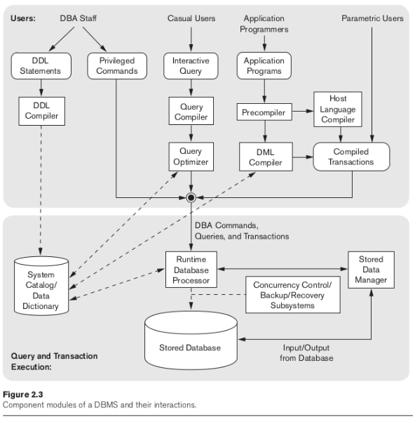
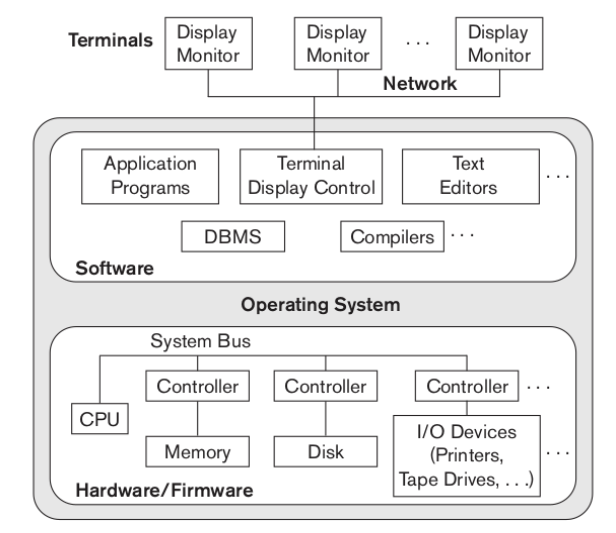
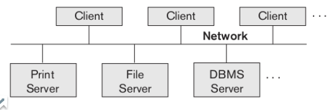

# Arquitetura de Banco de Dados

## Arquitetura: Modelos, Esquemas e Instâncias

### Modelo
#### O que é abstrair?
Abstrair significa simplificar e generalizar algo, removendo aspectos particulares de um contexto específico. O objetivo é criar uma representação mais abrangente e essencial, que possa ser aplicada a diferentes cenários.

- **Foco no essencial**: Retirar informações que particularizam o contexto e manter apenas o que é realmente necessário.
- **Abstração = Essencial**: Foco na essência do sistema.
- **Classificação**: Estruturada e organizada para facilitar a modelagem eficiente.

#### Primeiro Modelo de Dados: Físico
O **modelo físico** é a base para estruturar e organizar os dados no sistema, determinando como os dados serão armazenados fisicamente nos dispositivos de armazenamento.

---

## Esquemas, Instâncias e Estados do Banco de Dados

### Conceitos Básicos
- **Esquema**: Estrutura geral e fixa do banco de dados, definida para organizar os dados. Exemplo: a estrutura de tabelas, colunas e relacionamentos.
- **Instâncias**: Dados específicos armazenados no esquema em um momento no tempo. Ou seja, os dados "reais" presentes no banco.
- **Estados do Banco de Dados (BD)**: Representam as alterações nos dados ao longo do tempo devido a operações como inserções, exclusões e atualizações.

#### Por que criar um esquema?
Os dados mudam constantemente. Criar um esquema fornece uma base estável que suporta a consistência e a organização do banco de dados, mesmo com alterações nas instâncias.

### Snapshot (Exemplo)
Um **snapshot** é um estado momentâneo dos dados no banco. Ele representa a "fotografia" de como o banco está em um momento específico.

#### Exemplo: Banco de Dados de Alunos
Tabelas e estrutura:
- **STUDENT**: `name`, `student_number`, `class`, `major`
- **COURSE**: `course_name`, `course_number`, `credit_hours`, `department`
- **PREREQUISITE**: `course_number`, `prerequisite_number`
- **SECTION**: `section_identifier`, `course_number`, `semester`, `year`, `instructor`
- **GRADE_REPORT**: `student_number`, `section_identifier`, `grade`

- **Estado inicial (Snapshot)**: O banco está vazio ou possui os dados iniciais.
- **Estado válido**: Após operações (inserções, atualizações ou exclusões), o banco ainda está consistente com as regras do esquema.
- **Metadados**: Incluem a descrição do esquema, construtores e restrições (por exemplo, tipos de dados, chaves primárias e estrangeiras).

---

## Three-Schema Architecture

A arquitetura de três esquemas isola os dados das aplicações, garantindo flexibilidade e independência entre os diferentes níveis.

### Componentes
1. **External Level** (Nível Externo):
   - Visualizações externas para usuários finais.
   - Representa diferentes perspectivas do banco, como relatórios personalizados.

2. **Conceptual Level** (Nível Conceitual):
   - Representação lógica do banco.
   - Inclui o esquema conceitual (entidades, atributos e relacionamentos).

3. **Internal Level** (Nível Interno):
   - Representação física do banco.
   - O esquema interno descreve como os dados são armazenados (estruturas físicas).

### Independência de Dados
- **Independência Lógica**: Isola o modelo conceitual das visualizações externas. Permite mudanças no nível lógico sem impactar os usuários finais.
- **Independência Física**: Isola o modelo interno do modelo conceitual. Permite mudanças na forma como os dados são armazenados fisicamente sem afetar o esquema conceitual.

---

## Arquitetura: Linguagem, Interface e Ambiente de SGBDs

### Linguagens
1. **DDL (Data Definition Language)**: Define o esquema do banco (criação de tabelas, chaves, etc.).
2. **DML (Data Manipulation Language)**: Manipula os dados (operações CRUD: Create, Read, Update, Delete).
   - **Alto nível**: Não procedural (ex.: SQL).
   - **Baixo nível**: Procedural, com maior controle sobre as operações.
3. **SDL (Storage Definition Language)**: Define como os dados são organizados no nível físico.
4. **VDL (View Definition Language)**: Define as visualizações externas do banco de dados.

### Interfaces
- **Web Clients e Aplicativos Mobile**: Acessam o banco remotamente.
- **Interfaces Gráficas (GUI)**: Fornecem formulários e ferramentas visuais para interação.
- **NLI (Natural Language Interface)**: Permitem buscas por palavras-chave ou comandos por voz.
- **Interfaces especializadas**: Voltadas para administradores de banco de dados (DBAs) e usuários avançados.

### Ambientes e Utilitários

- **Ambiente modularizado**: Divide o software de SGBD em módulos para maior organização.
- **Utilitários de gerenciamento**: 
  - Backup e restauração.
  - Reorganização do armazenamento.
  - Monitoramento de desempenho.
- **Ferramentas adicionais**:
  - Dicionário de dados.
  - Estações de trabalho dedicadas.
  - Software de comunicação entre sistemas.

---

## Arquitetura: Modelo Cliente-Servidor e Classificação de SGBDs

### Arquitetura Física

1. **Arquitetura Centralizada**:
   - Todos os dados e o processamento ocorrem em um único sistema.
   - Exemplo: Bancos legados utilizados em mainframes.

2. **Arquitetura Cliente-Servidor**:
   - Dados são processados em servidores e acessados por clientes (computadores ou dispositivos remotos).
   - Exemplo: Aplicações web modernas.

### Classificação de SGBDs
Os SGBDs podem ser classificados com base nos seguintes critérios:
1. **Modelo de dados**:
   - Relacional (baseado em tabelas).
   - NoSQL (orientado a documentos, chave-valor, grafos, etc.).
   - Hierárquico ou em rede.
2. **Número de usuários**:
   - Monousuário: Apenas um usuário por vez.
   - Multiusuário: Suporta vários usuários simultaneamente.
3. **Número de sites**:
   - Centralizado: Todos os dados em um único local.
   - Distribuído: Dados espalhados por vários locais.
4. **Custo**:
   - Sistemas gratuitos (ex.: MySQL, PostgreSQL).
   - Sistemas proprietários (ex.: Oracle, SQL Server).
5. **Caminho de acesso**:
   - OLTP (Processamento de Transações Online): Voltado para operações do dia a dia.
   - Sistemas analíticos: Voltados para análise e suporte à decisão (ex.: data warehouses).

---

## Resumo
A arquitetura de banco de dados organiza modelos, esquemas e instâncias para estruturar e gerenciar dados de forma eficiente. A **Three-Schema Architecture** promove a independência entre os níveis de abstração, permitindo flexibilidade e consistência. Os SGBDs utilizam linguagens e interfaces para facilitar operações e suportam diferentes arquiteturas, como cliente-servidor. A classificação dos SGBDs depende de critérios como modelo de dados, número de usuários e localização dos dados.

---
