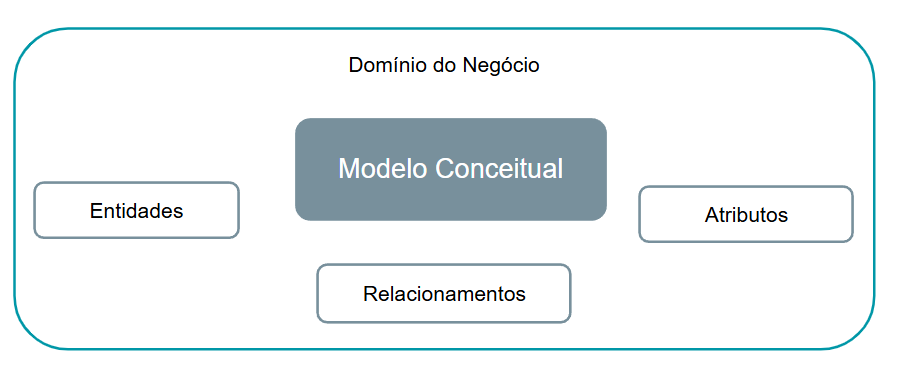

# Explorando o Modelo Entidade-Relacionamento (ER)

## Modelo ER

### Domínio do Negócio
- **Entidades**: Elementos principais do modelo.
- **Modelo Conceitual**: Representação abstrata do problema.
- **Atributos**: Características associadas às entidades.
- **Relacionamentos**: Conexões entre entidades.

---

## Diagrama ER

### Características
- **Raras Modificações**: Uma vez definido, o diagrama tende a ser estável.
- **Facilidade de Manipular**: Ferramentas para criação e manutenção.
- Representa o **esquema ER do banco de dados**.

---

## Entidades

### Definição
- **Componente Básico**: Elemento fundamental no modelo ER.
- **Existência Independente**: Uma entidade existe por si só.
- **Atributos**: Descrevem as propriedades de uma entidade.

**Entidade ↔ Objetos**

### Instâncias

- **Entidade em uma forma artificial**: Representa uma classe de objetos.
- **Conjunto de Entidades**: Instâncias relacionadas ao mesmo tipo de entidade.

---

## Atributos

### Definição
- **Características ou Descrições** das entidades.
- Relacionados diretamente às instâncias.

### Tipos
- **Atômico**: Não divisível (ex.: CPF).
- **Composto**: Divisível em partes menores (ex.: Nome completo → Nome, Sobrenome).

- **Multivalorados**: Contém mais de um valor (ex.: Telefones).
- **Armazenados e Derivados**: Armazenados diretamente ou calculados a partir de outros atributos.
- **Nulos**: Quando não possuem valor.
- **Complexos**: Combinação de compostos e multivalorados.

---

## Entidade Fraca

### Características
- **Sem chave obrigatória**: Depende de outra entidade para existir.
- **Dependência**: Relacionada a uma entidade forte.
- **Exclusão em Cascata**: A exclusão de uma entidade forte exclui suas entidades fracas associadas.

---

## Chaves

- **Elementos do Diagrama ER (DER)**:
  - **Entidades**.
  - **Atributos**.
  - **Chaves** (Restrições - Constraint).

---

## Relacionamentos

### Classificações
- **Grau**: Número de entidades envolvidas (Binário, Ternário, N-ário).
- **Auto-relacional**: Entidade relacionada a si mesma.
- **Cardinalidade**: Representa quantas instâncias de uma entidade estão relacionadas a outra (1:1, 1:N, N:M).

---

## Anotações

- **Entidades**: Classes ou objetos no modelo.
- **Relacionamentos**: Agregações entre entidades.
- **Atributos**: Propriedades elementares das entidades.

---

# Refinando o Design ER para a Empresa (COMPANY)

### Relacionamentos Identificados
1. **Empregado ↔ Departamento**:
   - Gerencia
   - Trabalha para
2. **Departamento ↔ Projeto**:
   - Controla
3. **Empregado ↔ Empregado**:
   - Supervisiona
4. **Empregado ↔ Projeto**:
   - Trabalha em
5. **Empregado ↔ Dependente**:
   - Dependentes de

  

---

## Alternativas - UML

### Características
- Linguagem amplamente usada para o desenvolvimento de software.
- Trabalha com diferentes visões:
  - **Interpretada**: Representação do modelo para leitura.
  - **Construída**: Base para implementação.

### Benefícios
- **Compreensão Facilitada**.
- **Liberdade para Desenvolvedores**.
- **Orientação a Objetos**.

### Anotação em UML
- **Classe**: Representa entidades.
- **Atributos**: Propriedades das classes.
- **Operações**: Métodos ou ações das classes.
- **Relacionamentos**:
  - Associação.
  - Agregação.

**Weak (Fraco)**: Qualified association, discriminator.

---

## Relacionamentos N-ários

### Definição
- **Ternário** ou N-ário.
- Perspectiva diferente de relacionamentos binários.
- Observação: As **instâncias refletem a visão** do relacionamento.

Exemplo:  
**Médico ↔ Atende ↔ Paciente**

---

## Agregação

Exemplo de agregação:  
**Consulta**:
- **Médico** - Atende - **Paciente**  
- **Consulta** - Prescreve - **Exame**

