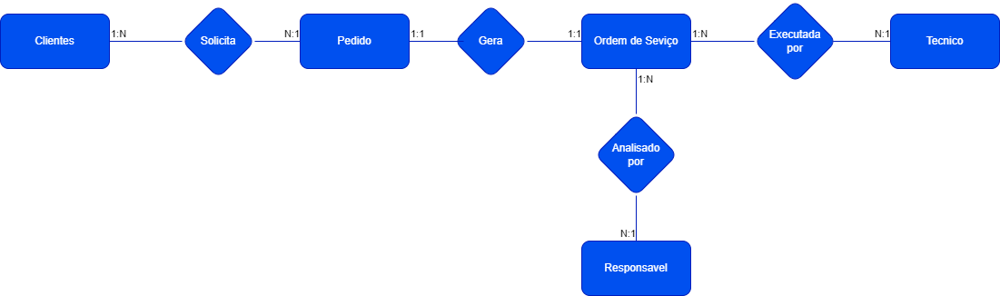
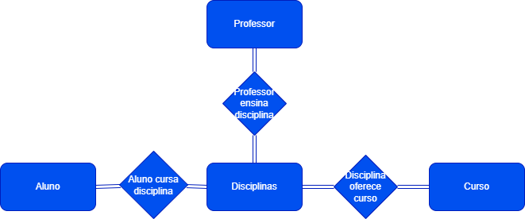
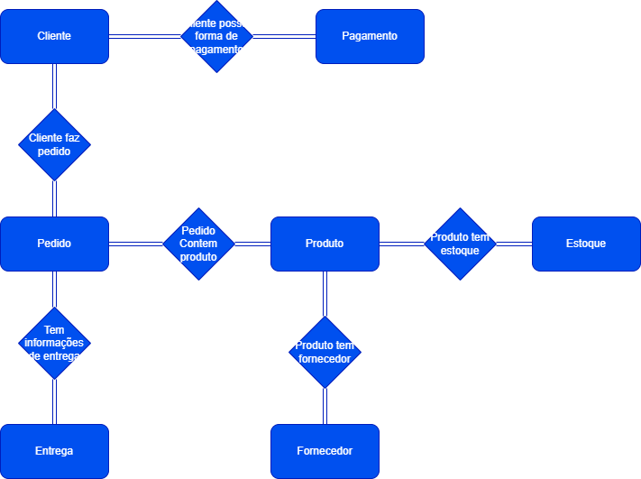

# Projeto Conceitual de Banco de Dados - E-COMMERCE

### Etapas do Projeto:
1. **Levantamento de Requisitos:** Entendimento das necessidades do sistema.
2. **Projeto Conceitual:** Representado por um **Modelo ER (Entidade-Relacionamento)**.
3. **Projeto Lógico:** Transformação do modelo ER em um **Modelo Relacional**.

---

## Contexto: Ordem de Serviço

### **Contexto:**
- Dentro de uma empresa, os clientes solicitam ações ao helpdesk.
- Essas solicitações são convertidas em **ordens de serviço**, caso sejam viáveis.
- Após a criação da ordem de serviço:
  - Um **técnico** é designado para executar a tarefa.
  - Quando finalizada, a ordem de serviço é **arquivada**.

# **Modelo ER - Ordem de Serviço**

## **Entidades Identificadas**
1. **Cliente**: Quem solicita os pedidos.
2. **Pedido**: A solicitação feita pelo cliente.
3. **Ordem de Serviço**: O documento ou ação que formaliza a execução do pedido.
4. **Responsável**: A pessoa que analisa e aprova a ordem de serviço.
5. **Técnico**: Quem executa a ordem de serviço.

---

## **Relacionamentos Identificados**
### **1. Solicita**
- Relaciona o **Cliente** ao **Pedido**.
- **Cardinalidade**: 
  - Um cliente pode solicitar vários pedidos (*1:N*).  
  - Cada pedido pertence a um único cliente (*N:1*).

### **2. Gera**
- Relaciona o **Pedido** à **Ordem de Serviço**.
- **Cardinalidade**: 
  - Cada pedido pode gerar uma única ordem de serviço (*1:1*).  
  - Cada ordem de serviço é gerada por um único pedido (*1:1*).

### **3. Analisada por**
- Relaciona o **Responsável** à **Ordem de Serviço**.
- **Cardinalidade**: 
  - Um responsável pode analisar várias ordens de serviço (*1:N*).  
  - Cada ordem de serviço é analisada por um único responsável (*N:1*).

### **4. Executada por**
- Relaciona o **Técnico** à **Ordem de Serviço**.
- **Cardinalidade**: 
  - Um técnico pode executar várias ordens de serviço (*1:N*).  
  - Cada ordem de serviço é executada por apenas um técnico (*N:1*).

### **5. Arquiva**
- Relaciona a **Ordem de Serviço** ao estado final de arquivamento.
- **Cardinalidade**: 
  - Uma ordem de serviço pode ser arquivada apenas uma vez.

---

# Projeto de Universidade

## 1. Narrativa: Escopo de Universidade

### 1.1 Narrativa - Alunos

#### Descrição:
- A universidade possui diversos alunos, que podem estar matriculados em mais de um curso de graduação.
- Os alunos podem fazer cursos extras oferecidos tanto internamente (pela universidade) quanto externamente (por outras instituições) para contar como horas complementares.
- Não há restrição quanto ao número de matérias que um aluno pode cursar, desde que não haja sobreposição de horários.
- Os alunos são submetidos a duas provas por semestre para cada disciplina. Eventuais trabalhos e outras avaliações podem ser solicitados pelo professor e devem ser considerados para a composição da nota final.

#### Exemplo:
- **Aluno A** está matriculado nos cursos de *Ciência da Computação* e *Engenharia Elétrica*. Ele pode cursar disciplinas em ambos os cursos, desde que os horários não se sobreponham.
- **Aluno B** faz um curso de *Desenvolvimento Web* (curso extra) fornecido internamente pela universidade, que soma horas complementares para a sua graduação.

#### Perguntas para reflexão:
- Quais dados precisamos armazenar sobre os alunos? 
    - Exemplo: Nome, matrícula, cursos matriculados, notas, disciplinas cursadas, carga horária de cursos extras, etc.
- Como devemos tratar a aprovação dos alunos? 
    - Exemplo: Média ponderada das notas das provas, incluindo a contribuição de trabalhos e atividades extras.

### 1.2 Narrativa - Disciplinas

#### Descrição:
- Cada disciplina é ministrada por um professor específico. Restrição: cada disciplina tem um único professor responsável.
- Algumas disciplinas possuem pré-requisitos que devem ser cumpridos antes de matricular-se em uma disciplina. O mesmo pré-requisito pode estar associado a mais de uma disciplina.
- Algumas disciplinas podem ser comuns a cursos distintos. Exemplo: *Cálculo 1* pode ser oferecido tanto para *Ciência da Computação* quanto para *Engenharia*.
- O ciclo de vida de uma disciplina é semestral, ou seja, cada disciplina ocorre a cada semestre.

#### Exemplo:
- **Disciplina Cálculo 1**: oferecida tanto para o curso de *Computação* quanto para *Engenharia*, e tem como pré-requisito o curso de *Matemática Básica*.
- **Disciplina Algoritmos**: oferecida apenas para o curso de *Ciência da Computação* e ministrada por *Professor João*.

#### Perguntas para reflexão:
- Quais dados são essenciais para registrar sobre as disciplinas? 
    - Exemplo: Nome da disciplina, código, professor responsável, pré-requisitos, cursos que oferecem, semestre letivo.
- Como tratamos o relacionamento entre disciplinas e cursos?
    - Exemplo: Disciplina *Cálculo 1* sendo compartilhada entre dois cursos.

### 1.3 Narrativa - Professores

#### Descrição:
- Os professores que ministram as disciplinas estão associados às coordenações de seus respectivos cursos. Exemplo: *Prof. João* ensina *Cálculo 1* para os cursos de *Computação* e *Engenharia*.

#### Exemplo:
- **Professor João** é responsável pelas disciplinas de *Cálculo 1*, *Álgebra Linear* e *Estruturas de Dados*.
- **Professora Maria** ensina disciplinas como *Física 1* e *Mecânica* para o curso de *Engenharia*.

#### Perguntas para reflexão:
- Quais informações sobre os professores são relevantes para armazenar?
    - Exemplo: Nome, matrícula, cursos que leciona, especialização, carga horária, coordenador de curso.

---
# Projeto de Ecommerce

## 1. Narrativa: Produto

### Descrição:
- Os produtos são vendidos por uma única plataforma online, ou seja, a plataforma não permite vendedores distintos (sem marketplace).
- Cada produto está vinculado a um **fornecedor** específico.
- Um ou mais produtos podem ser incluídos em um único **pedido**.

### Exemplos:
- **Produto A** (ex: "Tênis Adidas") é fornecido por **Fornecedor X**.
- **Produto B** (ex: "Camisa Nike") também é fornecido por **Fornecedor Y**.
- Um cliente pode adicionar ambos os produtos a um único pedido.

### Perguntas para reflexão:
- Como manter o vínculo entre os produtos e seus fornecedores?
- Como garantir que os pedidos contenham apenas os produtos disponíveis na plataforma?

---

## 2. Narrativa: Cliente

### Descrição:
- O cliente pode se cadastrar no site usando seu **CPF** (Pessoa Física) ou **CNPJ** (Pessoa Jurídica).
- O **endereço** do cliente é utilizado para calcular o **valor do frete**.
- Um cliente pode realizar múltiplos **pedidos**.
- O cliente possui um **período de carência para devolução dos produtos** após a compra.

### Exemplos:
- **Cliente A** se cadastra com seu **CPF** e realiza uma compra de 3 produtos.
- **Cliente B** se cadastra com seu **CNPJ** (empresa) e compra produtos para revenda.
- **Cliente A** realiza um pedido e, caso não goste do produto, pode devolvê-lo dentro do prazo de carência estipulado (ex: 7 dias após a entrega).

### Perguntas para reflexão:
- Quais dados são essenciais para o cadastro de um cliente?
- Como calcular o valor do frete com base no endereço do cliente?

---

## 3. Narrativa: Pedido

### Descrição:
- Os **pedidos** são criados pelos clientes quando eles selecionam os produtos que desejam comprar.
- Cada pedido possui informações sobre a **compra**, o **endereço de entrega** e o **status da entrega**.
- Um pedido pode conter **um ou mais produtos**.
- O pedido pode ser **cancelado** pelo cliente dentro de um prazo ou em caso de problemas de estoque.

### Exemplos:
- **Pedido 1**: Cliente A compra os produtos "Tênis Adidas" e "Camisa Nike" de um único pedido.
- **Pedido 2**: Cliente B compra apenas "Notebook Dell" e o pedido é enviado com um **status** de "Em Processamento".
- **Pedido 1** pode ser **cancelado** se o cliente mudar de ideia antes do envio.

### Perguntas para reflexão:
- Quais informações devem ser mantidas sobre cada pedido?
- Como gerenciar os **status de entrega** dos pedidos (ex: "Em Processamento", "Enviado", "Entregue")?
- Como o cliente pode cancelar um pedido de forma simples?

---

## 4. Narrativa: Fornecedor e Estoque

### Descrição:
- Cada produto possui um **fornecedor único**. O fornecedor é responsável por fornecer o produto à plataforma.
- O **estoque** de cada produto é monitorado pela plataforma, e a quantidade de **estoque disponível** deve ser atualizada conforme as compras são realizadas.
- Se um produto estiver **fora de estoque**, ele ficará **indisponível** para novos pedidos até que o fornecedor atualize o estoque.

### Exemplos:
- **Fornecedor X** fornece "Tênis Adidas" e tem 100 unidades em estoque.
- **Fornecedor Y** fornece "Camisa Nike" e tem 50 unidades em estoque.
- Quando **Pedido 1** de Cliente A é confirmado, o estoque de "Tênis Adidas" diminui para 99 unidades.

### Perguntas para reflexão:
- Como gerenciar as quantidades de estoque para garantir que os produtos não fiquem disponíveis quando fora de estoque?
- Como a plataforma pode notificar o fornecedor quando o estoque de um produto estiver baixo?

---

## 5. Relacionamentos entre Entidades

Agora que as narrativas estão claras, podemos entender como as entidades se relacionam no sistema. Aqui estão as principais entidades e seus relacionamentos:

### Entidades:
- **Cliente**: Responsável por fazer pedidos. Tem CPF ou CNPJ.
- **Produto**: Os itens disponíveis para compra. Cada produto tem um fornecedor.
- **Pedido**: Criado por clientes, contendo produtos.
- **Fornecedor**: Responsável por fornecer os produtos.
- **Estoque**: Quantidade disponível de cada produto.

### Relacionamentos:
1. **Cliente-Faz-Pedido**:
   - Um cliente pode criar um ou mais pedidos.
   - Relacionamento de 1 para N entre **Cliente** e **Pedido**.
   
2. **Pedido-Contém-Produto**:
   - Um pedido pode conter um ou mais produtos.
   - Relacionamento de N para N entre **Pedido** e **Produto**.

3. **Produto-Tem-Fornecedor**:
   - Cada produto possui um único fornecedor.
   - Relacionamento de 1 para N entre **Fornecedor** e **Produto**.

4. **Produto-Tem-Estoque**:
   - Cada produto tem uma quantidade disponível em estoque.
   - Relacionamento de 1 para 1 entre **Produto** e **Estoque**.

---

## Ferramentas de Design

### **Ferramenta Alternativa: Draw.IO**
- Uma ferramenta popular para diagramas de fluxo e ER.
- Possui Extension no Visual Studio Code;
- https://marketplace.visualstudio.com/items?itemName=hediet.vscode-drawio
- Recursos:
  - Interface intuitiva.
  - Integração com Google Drive, OneDrive, entre outros.

## Extensão: **ERD Editor**
- **Descrição:**
  Uma extensão desenvolvida para modelagem ER (Entity-Relationship) diretamente no **Visual Studio Code**.
  https://marketplace.visualstudio.com/items?itemName=dineug.vuerd-vscode
- **Recursos:**
  - Ferramenta prática para criar diagramas ER no formato de texto simples.
  - Converte descrições de relacionamentos e entidades em diagramas visuais.
  - Integração com o editor de código, oferecendo uma experiência fluida entre modelagem e desenvolvimento.
  - Ideal para projetos ágeis e colaboração em equipes técnicas.

### **Ferramenta Alternativa: DBDesigner.net**
- Plataforma online para design de bancos de dados.
- Recursos:
  - Criação visual de modelos relacionais.
  - Exportação direta para SQL.
  - Compartilhamento e colaboração em projetos.
