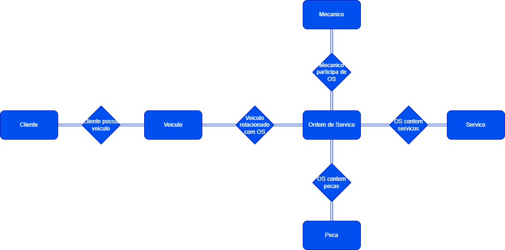

## Oficina - Narrativa 

### Levantamento de Requisitos

- Sistema de controle e gerenciamento de execucao de ordens de servico em uma oficina mecanica
- clientes levam veiculos a oficina mecanica para serem consertados ou para passarem por revisoes periodicas
- cada veiculo é designado a uma equipe de mecanicos que identifica os servicos a serem executados e preenche uma OS com data de entrega
- A partir da OS, calcula-se o valor de cada serviço, consultando-se uma tabela de referencia de mão-de-obra
- O valor de cada peça tambem ira compor a OS
- O cliente autoriza a execução dos serviços
- A mesma equipe avalia e executa os serviços
- Os mecanicos possuem codigo, nome, endereço e especialidade
- Cada OS possui: n, data de emissão, um valor, status, e uma daa para conclusão dos trabalhos.
- Uma OS pode ser composta por varios servicos e um mesmo servico pode estar contido em mais de uma OS.
- Uma OS pode ter varios tipos de peça e uma peça pode estar presente em mais de uma OS

## Relacionamentos entre Entidades

### Relacionamentos Identificados:
1. **Cliente possui veiculo**:
   - Um cliente pode possuir **um ou mais veículos**.
   - Relacionamento de 1 para N entre **Cliente** e **Veículo**.

2. **Veiculo relacionado com OS**:
   - Um veículo pode estar associado a **várias ordens de serviço (OS)**.
   - Relacionamento de 1 para N entre **Veículo** e **OS**.

3. **Mecanico Participa de OS**:
   - Um mecânico pode trabalhar em **várias ordens de serviço (OS)**.
   - Uma OS pode ter **uma equipe de mecânicos**.
   - Relacionamento de N para N entre **Mecânico** e **OS**.

4. **OS Contem Serviços**:
   - Uma OS pode conter **vários serviços**.
   - Um serviço pode estar presente em **várias OS**.
   - Relacionamento de N para N entre **OS** e **Serviço**.

5. **OS Contem Peças**:
   - Uma OS pode conter **várias peças**.
   - Uma peça pode estar presente em **várias OS**.
   - Relacionamento de N para N entre **OS** e **Peça**.

**[Ferramentas de Design](https://github.com/DavidRufino/Minha-Anotacoes-Heineken-Intelig-ncia-Artificial-Dados-Copilot/blob/main/3-4.%20Refinando%20um%20Projeto%20Conceitual%20de%20Banco%20de%20Dados%20%E2%80%93%20E-COMMERCE/README.md#ferramentas-de-design)**