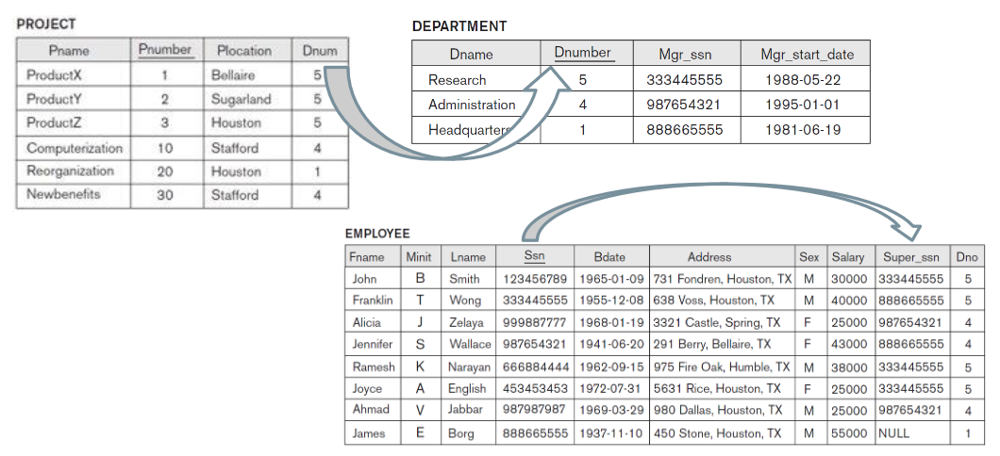

# Modelo Relacional e Mapeamento Relacional com Banco de Dados

## Conceitos Formais do Modelo Relacional

### Conceitos

**Modelo Relacional**  
- Estrutura para organizar dados em tabelas (relações), onde:  
  - Colunas representam atributos.  
  - Linhas representam tuplas.  

**Tabela x Arquivos**  
- Tabelas: Estrutura lógica usada em bancos de dados.  
- Arquivos: Estrutura física para armazenar dados.

**Entidades**  
- Representam conceitos ou objetos no mundo real.  
- Exemplo de entidade:  
  CREATE TABLE Carro (  
      Placa VARCHAR(7) PRIMARY KEY,  
      Modelo VARCHAR(50),  
      Cor VARCHAR(30)  
  );

**Classe -> Objeto**  
- Classe descreve entidades. Objeto é uma instância de uma classe.  

**Tupla**  
- Linha em uma tabela.

**Atributo**  
- Coluna de uma tabela.

**Relação**  
- Conjunto de tuplas (tabela completa).

**Valores Atômicos**  
- Cada atributo contém valores indivisíveis.  
- Exemplo: Um campo de telefone armazena apenas um número por vez.

**Grupos de Atributos**  
- São agrupados para especificar nomes.

---

### Esquema Relacional

**Definição Formal**  
- Representação de uma tabela e seus atributos:  
  R(a1, a2, a3, ..., an)  
  Onde:  
  - R: Nome da relação.  
  - Ai: Atributo.  
  - D: Domínio, conjunto de valores possíveis para um atributo.  

**Exemplo de Esquema Relacional**  
STUDENT(Name, Ssn, Home_phone, Address, Office_phone, Age, Gpa)

**Descrição dos Atributos**  
STUDENT(Name: string, Ssn: string, Home_phone: string, Address: string, Office_phone: string, Age: integer, Gpa: real)

**Instâncias de Relação**  
- Uma relação contém tuplas:  
  r = {t1, t2, t3, ..., tm}  
  Onde:  
  t = <v1, v2, v3, ..., vn>

**Cardinalidade**  
- Determinada pelo total de instâncias:  
  |dom(A1)| x |dom(A2)| x ... x |dom(An)|

**Exemplo de tabela em SQL com dados**  

---

## Características da Relação

**Relação x Arquivos x Tabelas**  
- Relação: Estrutura lógica baseada no modelo relacional.  
- Arquivos: Estrutura física de armazenamento.  
- Tabelas: Representação visual das relações.

**Valores Nulos**  
- Representam:  
  - Valor desconhecido.  
  - Valor existente, mas indisponível.  
  - Atributo que não se aplica.  
  - Valor indefinido.  
- Exemplo: Campos de telefone fixo e celular em uma tabela.

**Significado de Relação**  
- O predicado descreve a ação ou o estado relacionado às tuplas.  
- Exemplos:  
  - Afirmações declarativas.  
  - Uso da lógica de predicados para validar argumentos.  

**Notação**  
- Letras maiúsculas (Q, R, S): Representam relações.  
- Letras minúsculas (q, r, s): Estados da relação.  
- Letras (t, u, v): Representam tuplas.  
- Nome do atributo descreve seu papel.

---

## Restrições (Constraints) do Modelo Relacional

Restrições ajudam a manter a integridade dos dados em um banco de dados. Existem diferentes tipos de restrições:

### Restrições no Contexto de Banco de Dados

**Relações e Mini-Mundo**  
- As relações refletem o mini-mundo (conjunto de dados que o banco de dados representa).  
- Restrições garantem a consistência e integridade desses dados.

#### Categorias de Restrições  
1. **Inherent Model-Based Constraints**  
   - Características intrínsecas das relações.  
2. **Schema-Based Constraints**  
   - Definidas na estrutura do banco (DDL).  
3. **Application-Based Constraints**  
   - Impostas por regras de negócios específicas.

#### Dependência de Dados  
- Processos de normalização ajudam a identificar:  
  - Dependências funcionais.  
  - Dependências multivaloradas.

---

### Restrições Baseadas no Esquema do Banco de Dados

**Restrições de Domínio**  
- Um valor atribuído a um atributo deve pertencer ao seu domínio.  
- Exemplos de domínios:  
  - Time, Strings, Integer, Timestamp, Date, Float.  

**Exemplo de Tabela SQL com dados, Tuplas, Nome de Relações e Atributos**  

**Restrições de Chave**  
- Garantem que as tuplas sejam únicas em uma relação.  
- Chave primária e candidatas desempenham esse papel.

**Unicidade de Atributos**  
- Subconjunto de atributos (SK) deve ser único em todas as tuplas:  
  t1[SK] ≠ t2[SK]  
- Definem superchaves e chaves candidatas.  

---

## SGBDs e Esquemas Relacionais

**Esquema Relacional**  
- Um SGBD é composto por um conjunto de relações:  
  S = {R1, R2, ..., Rm}  
  Onde:  
  - R1, R2, ..., Rm: Representam as tabelas.  

**Estado de um SGBD Relacional**  
- Representado por:  
  DB = {r1, r2, ..., rm}  
  Onde cada r corresponde a uma instância de R.  

**Restrições de Integridade**  
- Garantem a consistência dos dados.  
- Exemplos:  
  - Constraints de domínio.  
  - Not Null.  
  - Chaves primárias e estrangeiras.

---

## Integridade Referencial e de Entidade

**Chave Primária**  
- Não pode ser nula.  
- Garante a identidade única de cada registro.  

**Chave Estrangeira**  
- Regras:  
  - O domínio do atributo de chave estrangeira (FK) deve coincidir com o domínio do atributo de chave primária (PK).  
  - Valores FK devem referenciar valores existentes em PK.  
- Exemplo:  
  t1[FK] = t2[PK]

**Integridade Referencial**  
- Mantém a consistência entre as entidades.  

**Exemplo de Tabela SQL com dados e Integridade Referencial**  

**Definição de Chave Estrangeira com DDL**  

---

## Mapeamento do Modelo ER para Relacional

**Design Lógico de Banco de Dados**  
- O modelo ER/EER é mapeado para o modelo relacional.

**Atributos e Restrições**  
- Atributos de valor único tornam-se colunas.  
- Restrições de entidade e referencial são mapeadas como PKs e FKs.  

**Projeto Lógico**  

### Mapeamento de Entidades

1. **Entidades Fortes (Regulares)**  
   - Criam relações diretas.  
   - PK pode ser simples ou composta.  
   - FK é opcional.  
     

2. **Entidades Fracas (Dependentes)**  
   - Dependem de uma entidade forte.  
   - Incluem uma FK que referencia a PK da entidade forte.  
     
   

---

### Relacionamentos Binários

1. **1:1**  
   - Representados como FK ou mesclando duas tabelas em uma.  
   

2. **1:N**  
   - FK na tabela correspondente ao lado N.

3. **M:N**  
   - Criam uma tabela intermediária com FKs referenciando ambos os lados.

---

### Relacionamentos N-ários  
- Representados como uma tabela adicional contendo FKs para cada entidade participante.  

---

## Mapeamento EER para Relacional

**Especialização**  
- Opções:  
  - Tabelas separadas para superclasse e subclasse.  
  - Uma única tabela contendo todos os atributos com um identificador de tipo.  

**Herança Múltipla**  
- Quando uma subclasse herda de mais de uma superclasse, o mapeamento precisa incluir todas as FKs relacionadas.  

**Union Types**  
- Representam entidades de diferentes tipos que compartilham propriedades comuns.  

---
