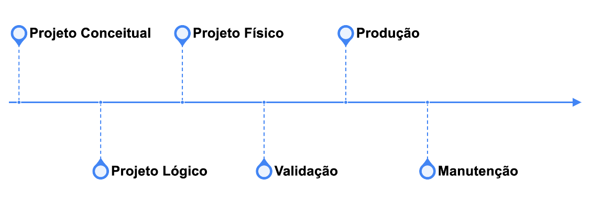
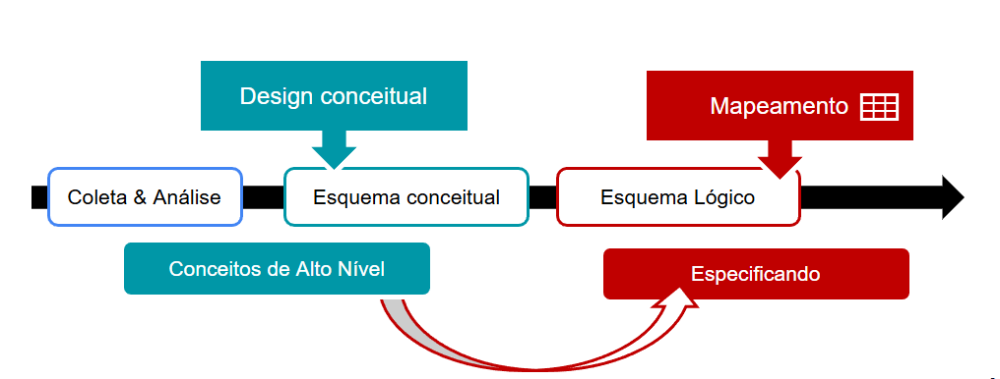
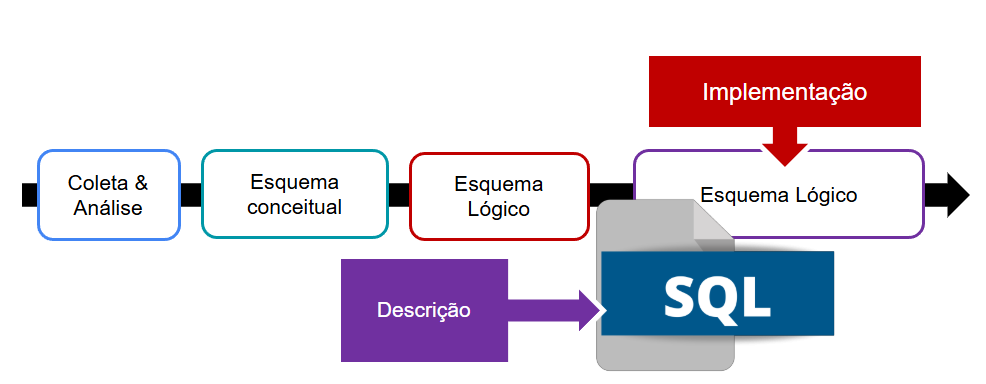
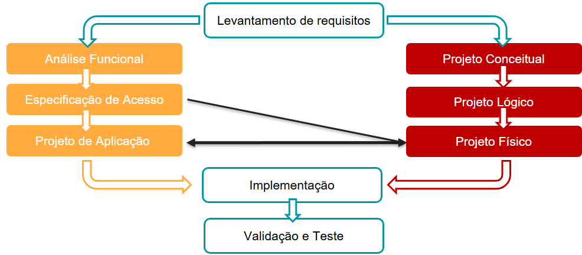
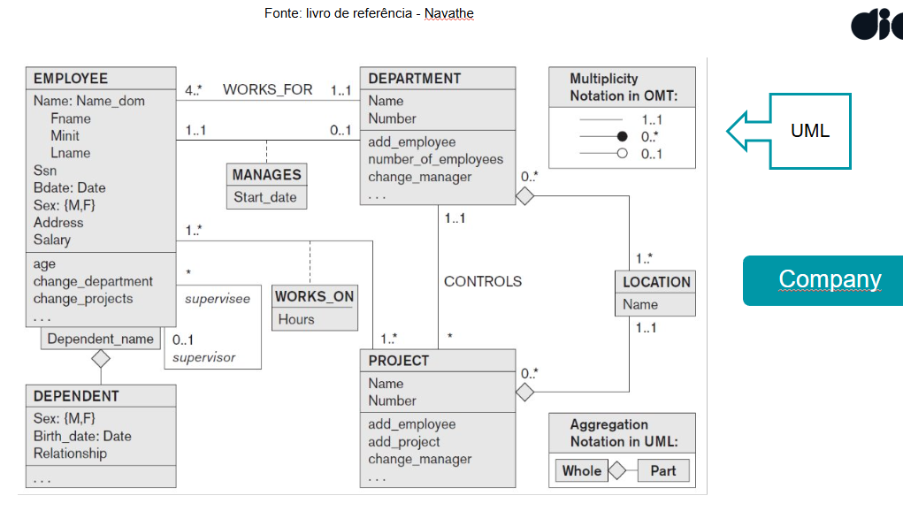
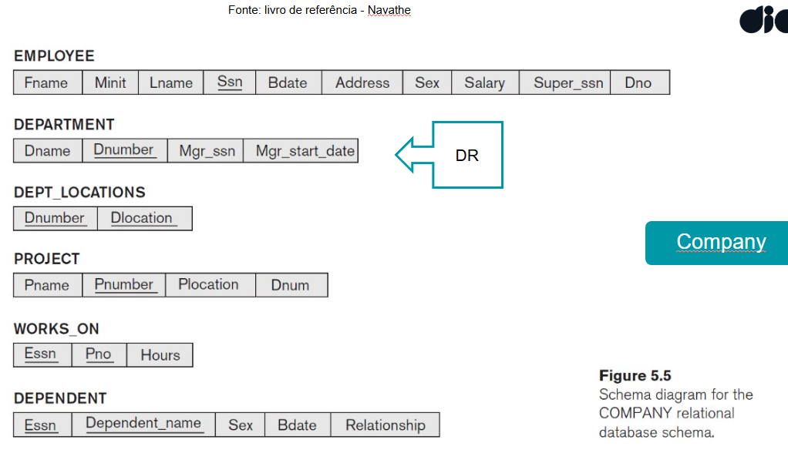
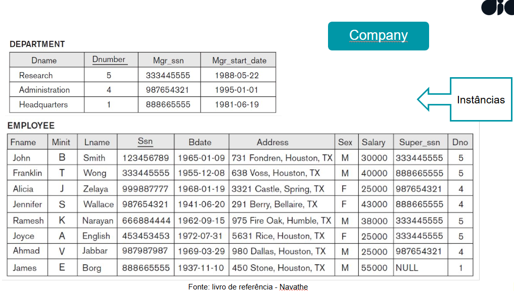

# Introdução à Modelagem & Projeto de Banco de Dados

## Características de um Banco de Dados
- **Persistência**: Dados armazenados de forma duradoura, resistindo a interrupções ou falhas do sistema.
- **Consistência**: Os dados seguem regras predefinidas, como restrições de integridade.
- **Confiabilidade**: Capacidade de proteger dados contra falhas e erros.
- **Flexibilidade**: Suporte para diferentes formas de acesso e manipulação de dados.
- **Independência de dados**: Separa a forma de armazenamento físico da forma lógica de apresentação.

---

## Mundo Fechado e Mundo Aberto

### Mundo Fechado (Close World Assumption - CWA)
- O mundo fechado assume que **o que não é conhecido como verdadeiro é considerado falso**.
  - Exemplo: Em um banco de dados de alunos, se não há registro indicando que um aluno se matriculou em um curso, assume-se que ele não está matriculado.
- Essa abordagem é comumente usada em bancos de dados relacionais.

### Mundo Aberto (Open World Assumption - OWA)
- O mundo aberto assume que **o que não é conhecido não pode ser determinado como falso ou verdadeiro**.
  - Exemplo: Se não há informações sobre a matrícula de um aluno em um curso, não é possível afirmar se ele está ou não matriculado.
- É comum em sistemas baseados em lógica, como a Web Semântica.

---

## Mini-Mundo

- O **Mini-Mundo** representa o **"universo de discurso"** (Universe of Discourse - UoD), ou seja, a realidade que o banco de dados modela.
- Ele é um subconjunto do mundo real, definido pelas necessidades e contexto de um sistema específico.

### Relação com o Mundo Fechado
- O Mini-Mundo segue a **Close World Assumption** (CWA), onde assume-se que todos os fatos do universo de discurso estão registrados no banco de dados. Tudo que não é registrado é considerado falso.

---

## Álgebra Relacional

### Introdução
- O **modelo relacional** é baseado na **álgebra relacional**, que, por sua vez, é fundamentada na **teoria dos conjuntos**.
- A álgebra relacional é uma **linguagem formal** utilizada para consultas e extração de dados, sendo a base para a linguagem SQL.

### Predicado
- O **predicado** é a parte de uma declaração que contém o verbo e traz informações sobre o sujeito.
- Na álgebra relacional, usamos **lógica de predicados** para definir condições e filtros para consulta de dados.
  - Exemplo: 
    ```sql
    SELECT * FROM alunos WHERE idade > 18;
    ```
    - Aqui, a condição `idade > 18` é um **predicado**, que filtra os alunos com mais de 18 anos.

### Operações da Álgebra Relacional
A álgebra relacional define um conjunto de operações que podem ser realizadas sobre os dados. Estas operações são divididas em:
1. **Baseadas na teoria dos conjuntos**:
   - **União (`UNION`)**: Combina duas tabelas, eliminando duplicatas.
   - **Interseção (`INTERSECT`)**: Retorna os registros que estão presentes em ambas as tabelas.
   - **Diferença (`EXCEPT`)**: Retorna os registros que estão em uma tabela, mas não na outra.
   - **Produto cartesiano**: Combina cada linha de uma tabela com todas as linhas de outra.

2. **Específicas do modelo relacional**:
   - **Seleção (`SELECT`)**: Filtra registros com base em condições.
   - **Projeção (`PROJECT`)**: Seleciona colunas específicas de uma tabela.
   - **Renomeação (`RENAME`)**: Renomeia tabelas ou colunas para facilitar o entendimento.
   - **Junção (`JOIN`)**: Combina registros de duas tabelas com base em uma condição.

3. **Lógicas**:
   - **AND, OR, NOT**: Usados para compor condições mais complexas.

### Funções Agregadas no SQL
As funções agregadas são operações que aplicam cálculos sobre conjuntos de dados:
- **ANY**: Verifica se pelo menos um registro atende à condição.
- **MAX**: Retorna o valor máximo.
- **MIN**: Retorna o valor mínimo.
- **AVG**: Calcula a média dos valores.
- **COUNT**: Conta o número de registros.
- **SUM**: Calcula a soma de valores.

#### Exemplo:
```sql
SELECT COUNT(*), AVG(salario) 
FROM empregados 
WHERE departamento = 'TI';
```

# Processo de Modelagem e Projeto de Banco de Dados

## Etapas do Processo



### 1. Projeto Conceitual
- Representa o **Mini-Mundo** por meio de um modelo abstrato, como o modelo entidade-relacionamento (ER).
- **Exemplo**: Definir entidades como `Aluno`, `Curso` e `Professor`, com seus atributos e relacionamentos.

### 2. Projeto Lógico
- Transforma o modelo conceitual em um esquema lógico, geralmente no modelo relacional.
- **Exemplo**: Converter a entidade `Aluno` para uma tabela com colunas como `id_aluno`, `nome` e `idade`.

### 3. Projeto Físico
- Define como os dados serão armazenados fisicamente no banco.
- **Exemplo**: Escolher índices, particionamento e tipos de armazenamento.

### 4. Validação
- Verifica se o modelo atende às necessidades do sistema e é consistente.
- **Exemplo**: Validar que consultas importantes podem ser realizadas eficientemente.

### 5. Produção
- Implementação do banco de dados no ambiente de produção, onde será utilizado pelos usuários.

### 6. Manutenção
- Atualizações e otimizações no banco para garantir desempenho e adaptabilidade.
- **Exemplo**: Adicionar novas colunas, modificar índices ou ajustar tabelas para novas demandas.

# Modelagem de Dados

## Banco de Dados Particular - Softwares - Queries & Updates

### Desenvolvimento

- **Flexibilidade no Processo**: Não enrijeça o processo. A metodologia deve ser adaptativa para melhor atender às necessidades do sistema.
- **Ciclo de Desenvolvimento**:
  1. **Agir**: Identificar os problemas.
  2. **Planejar**: Testar possíveis soluções.
  3. **Fazer**: Estudar resultados e implementações.
  4. **Checar**: Implementar a solução mais eficiente e testada.

---

## Como Nasce um Banco de Dados

### Desenvolvimento

**Como implementar um Banco de Dados?**
1. **Entender o contexto e requisitos**: Qual é o objetivo do sistema? Quais informações precisam ser armazenadas?
   - Exemplo: Sou uma empresa e tenho clientes, produtos e pedidos. Preciso organizar essas informações em um Sistema de Gerenciamento de Banco de Dados (SGBD) para persistência e automação.
   
2. **Definir o que será representado**: É crucial que o banco de dados seja:
   - Coerente com as informações a serem armazenadas.
   - Capaz de responder às perguntas que o sistema precisa solucionar.

3. **Transformar Dados em Informação**:
   - **Dados** são brutos, sem significado por si só.
   - **Informação** é o dado processado, refinado e útil para análise e tomada de decisão.

4. **Primeira Fase - Modelagem de Alto Nível**:
   - Desenvolver uma **narrativa** que defina o contexto do sistema.
   - Exemplo:
     - "Meu sistema precisa gerar vendas."
     - "As vendas são oriundas de pedidos."
     - "Os pedidos são criados por clientes, que precisam de um CPF válido e um cartão registrado no CPF."

5. **Requisitos e Acesso**:
   - Definir requisitos e restrições do sistema:
     - O cliente só pode comprar com CPF válido.
     - Somente cartões registrados no CPF do cliente podem ser usados.
   - Identificar perfis de acesso:
     - Exemplo: Clientes, gerentes, administradores.

6. **Processo Gradual de Criação**:
   - **Implementação**: Criação e definição do modelo.
   - **Arquitetura**: Escolha do SGBD e do tipo de banco (relacional, NoSQL, etc.).
   - **Funcionalidades**: Definir as operações essenciais.

---

### Cenários
Exemplos de sistemas que podem ser modelados:
- Colaboradores (RH).
- E-commerce.
- Bancos e sistemas financeiros.
- Universidades.
- Farmácias.
- Sistemas de produção.
- Bibliotecas.

---

## Desenvolvimento de Banco de Dados

O processo de desenvolvimento segue três etapas principais:

1. **Conceitual**: Representação de alto nível, próxima ao entendimento humano.
2. **Lógico**: Organização dos dados, estrutura das tabelas ou documentos.
3. **Físico**: Implementação no sistema, com detalhes de armazenamento e otimização.

---

## Design de Bancos de Dados - Projeto Conceitual

### Projeto Conceitual

- **Linguagem de Modelagem de Dados**:
  - **Objetivo**: Representar graficamente ou textualmente o fenômeno que será modelado.
  - Exemplos:
    - Modelo Entidade-Relacionamento (ER).
    - Diagramas UML.

- **Representação do Fenômeno**:
  - Sempre que modelamos, estamos criando uma **referência** para o fenômeno do mundo real.
  - Essa referência é usada para analisar e compreender o sistema.

- **Coleta de Dados**:
  - Identificar e analisar dados e requisitos.
  - Criar um **esquema conceitual**, que é a base de alto nível do sistema.

---

## Projeto Lógico

### Descrição

- **Foco**: SQL Relacional.
- O projeto lógico é a tradução do esquema conceitual para uma organização detalhada dos dados.
- Ele reflete as estruturas específicas do SGBD escolhido:
  - **Exemplo**: MySQL, Cassandra ou MongoDB possuem estruturas distintas que influenciam o projeto lógico.

### Modelo Relacional
- No modelo relacional:
  - Os **dados são organizados em tabelas** (entidades).
  - As tabelas representam os elementos principais do sistema.
  - **Exemplo**:
    - Tabela `Clientes`: colunas como `id_cliente`, `nome` e `cpf`.
    - Tabela `Pedidos`: colunas como `id_pedido`, `id_cliente`, `data`.

#### Etapas:



1. **Coleta & Análise**:
   - Levantar os requisitos para modelar os dados.
2. **Esquema Conceitual**:
   - Representação de alto nível (Modelo ER ou UML).
3. **Esquema Lógico**:
   - Tradução para tabelas, atributos e relacionamentos.

---

### Modelo Lógico para NoSQL

No caso de bancos de dados NoSQL, o processo é ajustado para refletir a flexibilidade e a estrutura dos modelos baseados em documentos, chave-valor ou grafos.

#### Exemplos de Modelos NoSQL:
1. **Documentos** (MongoDB):
   - Organização em coleções e documentos.
   - Estrutura flexível, com campos aninhados e arrays.
   - **Exemplo**:
     ```json
     {
       "cliente_id": 1,
       "nome": "João",
       "cpf": "123.456.789-00",
       "pedidos": [
         {
           "pedido_id": 101,
           "data": "2023-01-01",
           "valor": 200.50
         },
         {
           "pedido_id": 102,
           "data": "2023-02-15",
           "valor": 150.00
         }
       ]
     }
     ```

2. **Grafos** (Neo4j):
   - Representação de relacionamentos como nós e arestas.
   - **Exemplo**:
     - Nós: `Cliente`, `Produto`.
     - Relacionamentos: `Comprou`, `Avaliou`.

3. **Chave-Valor** (Redis, DynamoDB):
   - Organização em pares `chave:valor`.
   - **Exemplo**:
     - Chave: `cliente:1`.
     - Valor: `{ "nome": "João", "cpf": "123.456.789-00" }`.

---

## Resumo

- O desenvolvimento de um banco de dados segue um **processo evolutivo** que começa no **projeto conceitual**, avança para o **projeto lógico** e culmina no **projeto físico**.
- Enquanto o **modelo relacional** utiliza tabelas e relacionamentos normalizados, os **bancos NoSQL** permitem maior flexibilidade, ajustando-se às necessidades de desempenho e escalabilidade.
- A escolha do modelo ideal depende do contexto, requisitos e perfil de acesso do sistema.

# Mapeamento ER x Relacional

## Componentes Principais

### Entidades
- Identificar **qual tipo de entidade** está presente no modelo.
- Classificação de entidades:
  - **Entidades fortes**: Possuem chave primária própria.
  - **Entidades fracas**: Dependem de outra entidade para existir.

### Relacionamentos
- **Cardinalidade**:
  - **1:1** (Um para um).
  - **1:N** (Um para muitos).
  - **N:M** (Muitos para muitos).
- **Tipos**:
  - Binário (relacionamento entre duas entidades).
  - N-ário (relacionamento entre mais de duas entidades).

### Atributos
- **Multivalorados**:
  - Atributos que podem conter mais de um valor.
  - Exemplo: Telefones de contato (um cliente pode ter mais de um número de telefone).

### Restrições & Integridade
- **Restrições**:
  - Definem regras para os dados, como **chaves primárias**, **chaves estrangeiras** e **restrições de unicidade**.
- **Integridade**:
  - **Integridade referencial**: Garante que os dados relacionados entre tabelas estejam consistentes.
  - **Integridade de domínio**: Garante que os valores dos atributos estejam dentro do esperado (ex.: tipo e tamanho corretos).

---

# Projeto Físico

## Descrição do Modelo Lógico

- **Como será implementado?**
  - Baseado no esquema lógico, define os detalhes técnicos da estrutura do banco de dados.

## Parâmetros Físicos
1. **Estrutura e índices**:
   - Definir quais índices serão criados para otimizar consultas e atualizações.
2. **Organização e caminhos de arquivos**:
   - Escolher como os arquivos serão armazenados no disco (partições, localizações, etc.).
3. **Segurança e performance**:
   - Implementar controles de acesso, criptografia e técnicas de otimização para desempenho.

Exemplo visual:  


---

# Fases de Desenvolvimento de BDS e Aplicações

## Processo de Desenvolvimento

### Etapas



1. **Análise Funcional**:
   - Identificação das necessidades do sistema.
   - Levantamento de requisitos do cliente ou usuários.

2. **Projeto Conceitual**:
   - Criação de um modelo de alto nível que represente o problema (ex.: Diagrama Entidade-Relacionamento).

3. **Projeto Lógico**:
   - Transformação do modelo conceitual em um esquema lógico (ex.: tabelas relacionais).

4. **Projeto Físico**:
   - Definição de como o banco será implementado no sistema escolhido (ex.: estrutura dos arquivos, índices, otimizações).

5. **Especificação de Acesso**:
   - Definir como os usuários e aplicações interagirão com o banco.

6. **Projeto de Aplicação**:
   - Desenvolvimento de interfaces, APIs ou sistemas que acessam o banco de dados.

7. **Implementação**:
   - Criação do banco de dados no ambiente escolhido (MySQL, MongoDB, etc.).

8. **Validação e Teste**:
   - Garantir que o sistema funciona conforme esperado e atende aos requisitos.

---

# Aplicação - Modelagem dos Dados

## Exemplo Prático

**Objetivo**: Rastreamento de informações.

### Entidades Identificadas
1. **Empregados**
2. **Projetos**
3. **Departamentos**

### Levantamento de Dados e Requisitos
- **Empregados**:
  - Atributos: Nome, seguro social, endereço, salário, data de nascimento.
- **Departamentos**:
  - Atributos: Nome, número, agente (empregado).
  - Rastreamento: Data de início do gerente e locais do departamento.
- **Projetos**:
  - Atributos: Nome, número, localização.
  - Relacionamento com Departamentos:
    - Função: Os departamentos gerenciam projetos.
  - Relacionamento com Empregados:
    - Função: Os empregados trabalham em um ou mais projetos.

### Relacionamento entre Entidades
1. **Empregados -> Projetos -> Departamentos**:
   - Os empregados estão associados a projetos.
   - Os projetos estão vinculados a departamentos.

### Possíveis Restrições e Requisitos Adicionais
- Restrições de acesso e cardinalidade.
- Requisitos de rastreabilidade de informações (ex.: histórico de mudanças).

### Esquema Proposto
- **Departamentos**:
  - Atributos: Nome, número, agente (gerente), locais.
- **Empregados**:
  - Atributos: Nome, seguro social, endereço, salário, data de nascimento.
- **Projetos**:
  - Atributos: Nome, número, localização, departamento.









