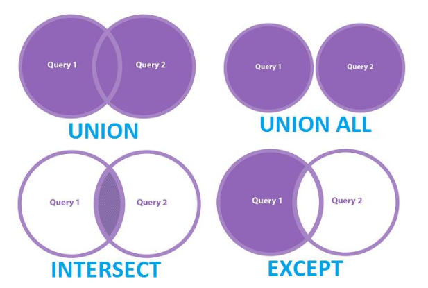

## Explorando Queries com SQL

**[4-1. Primeiros Passos com SQL](https://github.com/DavidRufino/Minha-Anotacoes-Heineken-Intelig-ncia-Artificial-Dados-Copilot/tree/main/4-1.%20Primeiros%20Passos%20com%20SQL#principais-comandos-ddl-1)** apresentado pela **Juliana Mascarenhas**

# Expressões em Statements SQL

## Atributos Aritméticos e Operações Matemáticas

Em SQL, é possível realizar **operações matemáticas** diretamente nas consultas. Para o PostgreSQL, você pode realizar operações aritméticas sobre **tipos numéricos** e **strings**. Vamos detalhar isso:

1. **Operações Aritméticas:**
   - O PostgreSQL suporta operações como soma (+), subtração (-), multiplicação (*), e divisão (/).
   - Para fazer cálculos com valores da tabela, você pode usar essas operações diretamente.

## Tipos de Dados

- **Numérico:** 
  - `INTEGER`, `NUMERIC`, `DECIMAL`, `FLOAT`, entre outros.
  - Exemplo: `salary * 0.11` para calcular 11% de um salário.

- **String:** 
  - `VARCHAR`, `CHAR`, `TEXT`, entre outros.
  - Para concatenar strings, você pode usar os operadores `||` ou a função `CONCAT`.

## Armazenamento e Resultado de Expressões

- **Dados Simples:**  
  Dados diretamente inseridos na tabela, como o salário ou o nome de um funcionário.
  
- **Resultado de Expressões:**  
  Quando você faz uma operação (como multiplicação ou soma) ou manipula strings, o resultado é um **dado complexo**. O **PostgreSQL** permite que você crie esses valores derivados diretamente na consulta.

- **Uso de Aliases:**  
  Para tornar a consulta mais legível, podemos **dar nomes (aliases)** às colunas resultantes. O alias pode ser dado com o uso da palavra-chave `AS`.

---

## Exemplo de Cálculo de Desconto sobre Salário

Vamos supor que você tenha uma tabela de funcionários e queira calcular o valor do INSS (11% do salário). O cálculo seria feito de forma simples como:

```sql
SELECT fname, lname, salary, salary * 0.11 AS inss  
FROM employee;
```

No exemplo acima, o valor do INSS (11% do salário) será calculado e exibido com o nome de coluna `inss` (que é um alias).

---

## Concatenando Strings

O PostgreSQL permite que você concatene strings de várias maneiras. Você pode usar o operador `||` ou a função `CONCAT()`.

### Exemplo de Concatenar Nome Completo com Operador `||`:

Se você quiser criar uma coluna chamada `complete_name` concatenando o nome, o sobrenome e o estado (se houver na tabela), pode usar:

```sql
SELECT fname, minit, lname || ',' || state AS complete_name  
FROM employee;
```

Neste exemplo, o nome completo é concatenado com o estado, separando por vírgula, e é dado um alias `complete_name` à coluna resultante.

### Exemplo de Concatenar com a Função `CONCAT`:

Se você preferir usar a função `CONCAT()`:

```sql
SELECT CONCAT(fname, ' ', minit, ' ', lname) AS complete_name  
FROM employee;
```

A função `CONCAT()` é útil, pois lida com valores nulos de forma mais eficiente (não retorna `NULL` quando algum dos valores a ser concatenado é `NULL`, ao contrário do operador `||`).

---

## Atributos Distintos (Unicidade)

Para garantir que um conjunto de resultados seja único, você pode usar a palavra-chave **DISTINCT**. Por exemplo, se você quiser retornar uma lista de nomes de funcionários, mas garantir que não haja duplicação:

```sql
SELECT DISTINCT fname, lname  
FROM employee;
```

Este exemplo vai retornar apenas combinações únicas de nome e sobrenome, removendo quaisquer duplicatas.

---

## Resumo e Exemplos

1. **Cálculos com Atributos:**
   SELECT fname, lname, salary, salary * 0.11 AS inss  
   FROM employee;

2. **Concatenar Atributos com `||`:**
   SELECT fname, minit, lname || ',' || state AS complete_name  
   FROM employee;

3. **Concatenar Atributos com `CONCAT`:**
   SELECT CONCAT(fname, ' ', minit, ' ', lname) AS complete_name  
   FROM employee;

4. **Atributos Distintos:**
   SELECT DISTINCT fname, lname  
   FROM employee;

# LIKE | BETWEEN

## LIKE - Comparação de Strings

O operador `LIKE` em SQL é utilizado para realizar comparações de padrões em **strings**. Ele é especialmente útil quando você não conhece a string completa ou deseja procurar por correspondências parciais.

### Usando o LIKE

- **% (Percentual):** Representa **qualquer número de caracteres** (inclusive nenhum).
- **_ (Underscore):** Representa **um único caractere**.

### Exemplo de LIKE com % e _

- **%**: O símbolo `%` pode ser usado para buscar qualquer sequência de caracteres.

  Exemplo:
  
  SELECT fname, lname  
  FROM employee  
  WHERE address LIKE '%Houston,TX%';  

  Neste exemplo, a consulta retorna todos os funcionários cujo campo `address` contém a sequência `Houston,TX` em qualquer parte da string.

- **_**: O símbolo `_` pode ser usado para buscar um **único caractere** em uma posição específica.

  Exemplo:
  
  SELECT fname, lname  
  FROM employee  
  WHERE lname LIKE 'Sm_th';  

  Essa consulta retorna todos os funcionários cujo sobrenome começa com "Sm", segue com qualquer caractere (substituído pelo `_`) e termina com "th". Assim, pode retornar "Smith" ou "Smoth", por exemplo.

---

## BETWEEN - Intervalo de Valores

O operador `BETWEEN` é utilizado para verificar se um valor está dentro de um intervalo especificado. O `BETWEEN` pode ser usado para **tipos numéricos** ou **datas**.

### Usando o BETWEEN para Números

Por exemplo, quando você deseja filtrar funcionários com **salário** dentro de um determinado intervalo:

```sql
SELECT *  
FROM employee  
WHERE salary BETWEEN 30000 AND 40000  
AND dno = 5;  
```

Neste exemplo:
- A consulta retorna todos os funcionários cujo **salário** está entre **30.000** e **40.000** e que pertencem ao **departamento 5** (identificado pela coluna `dno`).

### Usando o BETWEEN para Datas

Você também pode usar o `BETWEEN` para comparar **datas**. Por exemplo, para buscar funcionários que foram contratados em um período específico:

```sql
SELECT *  
FROM employee  
WHERE hire_date BETWEEN '2020-01-01' AND '2020-12-31';  
```

Neste exemplo, a consulta retornaria todos os funcionários contratados entre **1º de janeiro de 2020** e **31 de dezembro de 2020**.

- **LIKE** é usado para **comparação de padrões em strings**, com **%** representando qualquer número de caracteres e **_** representando um único caractere.
- **BETWEEN** é usado para **verificar se um valor está dentro de um intervalo** de valores (tanto para números quanto para datas).

# Comandos Baseados em Operações Matemáticas: UNION, INTERSECTION & EXCEPT



## UNION

O operador UNION é utilizado para combinar o resultado de duas ou mais consultas SELECT. Ele retorna apenas os registros distintos de ambas as consultas. Ou seja, ele elimina duplicatas automaticamente.

### Exemplo de UNION:

```sql
SELECT fname, lname  
FROM employee  
WHERE dno = 5  
UNION  
SELECT fname, lname  
FROM employee  
WHERE salary > 30000;  
```

Neste exemplo, o UNION combina os resultados das duas consultas e retorna apenas os registros distintos.

## UNION ALL

Diferente do UNION, o UNION ALL não elimina duplicatas. Ou seja, ele retorna todos os registros das consultas, incluindo duplicatas.

### Exemplo de UNION ALL:

```sql
SELECT fname, lname  
FROM employee  
WHERE dno = 5  
UNION ALL  
SELECT fname, lname  
FROM employee  
WHERE salary > 30000;  
```

O UNION ALL irá retornar todos os resultados, incluindo as duplicatas entre as duas consultas.

## INTERSECTION

O INTERSECTION retorna apenas as linhas que aparecem em ambas as consultas. No PostgreSQL, o comando equivalente é realizado com INTERSECT.

### Exemplo de INTERSECTION:

```sql
SELECT fname, lname  
FROM employee  
WHERE dno = 5  
INTERSECT  
SELECT fname, lname  
FROM employee  
WHERE salary > 30000;  
```

Essa consulta retorna apenas os funcionários que estão em ambos os conjuntos de dados (aqueles no departamento 5 e com salário maior que 30.000).

## EXCEPT

O operador EXCEPT retorna os registros da primeira consulta que não aparecem na segunda consulta. Ou seja, ele realiza a diferença entre duas consultas.

### Exemplo de EXCEPT:

```sql
SELECT fname, lname  
FROM employee  
WHERE dno = 5  
EXCEPT  
SELECT fname, lname  
FROM employee  
WHERE salary > 30000;  
```

Neste caso, serão retornados os funcionários do departamento 5 que não têm salário superior a 30.000.

---

# Nested Queries com SQL

## Comparação por Atributos Buscados

Uma nested query ou consulta aninhada é uma consulta dentro de outra consulta. Ela permite que você faça uma comparação de atributos com dados de uma outra tabela.

### Exemplo de Nested Query:

```sql
SELECT fname, lname  
FROM employee  
WHERE salary > (SELECT AVG(salary) FROM employee);  
```

Essa consulta retorna todos os funcionários cujo salário é superior à média de todos os salários.

## Nested Query - Consulta Aninhada

Em uma consulta aninhada, você tem uma consulta externa e uma consulta interna (ou subconsulta). A consulta interna retorna um valor, que é então utilizado pela consulta externa.

### Exemplo de Nested Query:

```sql
SELECT fname, lname  
FROM employee  
WHERE dno IN (SELECT dnumber FROM department WHERE dname = 'Sales');  
```

Neste exemplo, a subconsulta interna retorna o número de departamento do departamento "Sales", e a consulta externa retorna os funcionários desse departamento.

## IN - Comparação com um Conjunto

O operador IN é utilizado para comparar um valor com um conjunto de valores. Ele pode ser usado em uma nested query para comparar com múltiplos valores retornados pela subconsulta.

### Exemplo de IN:

```sql
SELECT fname, lname  
FROM employee  
WHERE salary IN (50000, 60000, 70000);  
```

Essa consulta retorna os funcionários com salários de 50.000, 60.000 e 70.000.

## = - Comparação com Unidades

O operador = compara um valor com um único valor específico. Ele é utilizado quando você sabe exatamente qual valor buscar.

### Exemplo de =:

```sql
SELECT fname, lname  
FROM employee  
WHERE dno = 5;  
```

Neste exemplo, a consulta retorna todos os funcionários que estão no departamento 5.

## Retorno: Tabela

O retorno de uma nested query pode ser tratado como uma tabela para a consulta externa. Isso permite que você compare os dados da consulta externa com o conjunto retornado pela subconsulta.

---

# Clausulas EXIST e UNIQUE

## EXIST

A cláusula EXISTS é utilizada para verificar se a subconsulta retorna algum resultado. Ela retorna TRUE se a subconsulta contiver pelo menos uma linha, e FALSE caso contrário.

### Exemplo de EXIST:

```sql
SELECT fname, lname  
FROM employee  
WHERE EXISTS (SELECT * FROM department WHERE dname = 'Sales' AND employee.dno = department.dnumber);  
```

Essa consulta retorna os funcionários que pertencem a departamentos chamados "Sales", se esse departamento existir.

## NOT EXISTS

O operador NOT EXISTS retorna TRUE se a subconsulta não retornar nenhum resultado. Isso é útil quando você deseja verificar a ausência de registros.

### Exemplo de NOT EXISTS:

```sql
SELECT fname, lname  
FROM employee  
WHERE NOT EXISTS (SELECT * FROM department WHERE dname = 'Sales' AND employee.dno = department.dnumber);  
```

Esse exemplo retorna os funcionários que não pertencem ao departamento "Sales".

## UNIQUE

A cláusula UNIQUE é utilizada para verificar se uma coluna contém valores únicos. Ela retorna TRUE se a subconsulta retornar um único valor.

### Exemplo de UNIQUE:

```sql
SELECT fname, lname  
FROM employee  
WHERE UNIQUE (SELECT dname FROM department WHERE dnumber = employee.dno);  
```

Essa consulta retorna os funcionários cujos departamentos têm um nome único.

- **UNION**: Combina os resultados de duas ou mais consultas, eliminando duplicatas.
- **UNION ALL**: Combina os resultados de duas ou mais consultas, incluindo duplicatas.
- **INTERSECTION (INTERSECT)**: Retorna apenas os registros que aparecem em ambas as consultas.
- **EXCEPT**: Retorna os registros da primeira consulta que não aparecem na segunda consulta.
- **Nested Queries**: Consultas dentro de outras consultas, permitindo a comparação e filtragem avançada de dados.
- **IN**: Compara um valor com um conjunto de valores.
- **EXISTS**: Retorna TRUE se a subconsulta tiver resultados, FALSE caso contrário.
- **NOT EXISTS**: Retorna TRUE se a subconsulta não tiver resultados.
- **UNIQUE**: Retorna TRUE se a subconsulta tiver um único valor.
