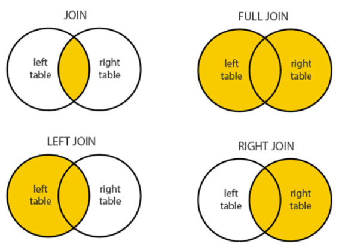

## CASE Statement

O **CASE Statement** é usado para realizar a troca de valores com base em condições. Ele é útil para mapeamento de valores, condições de troca, e criação de valores condicionais em consultas SQL.

### Exemplo de Atualização com CASE:

```sql
UPDATE employee 
SET salary = 
CASE 
    WHEN dno = 5 THEN salary + 2000 
    WHEN dno = 4 THEN salary + 1500
    WHEN dno = 1 THEN salary + 3000 
    ELSE salary + 0 
END;
```

Este exemplo atualiza o salário dos empregados de acordo com o número do departamento (`dno`).

---

### Exemplo de Mapeamento do Clima:


```sql
SELECT report_code, year, month, day, wind_speed, 
CASE 
    WHEN wind_speed >= 40 THEN 'HIGH' 
    WHEN wind_speed >= 30 THEN 'MODERATE' 
    ELSE 'LOW' 
END AS wind_severity 
FROM station_Data;
```

Aqui, a velocidade do vento é categorizada em "HIGH", "MODERATE" e "LOW", dependendo do valor de `wind_speed`.

---

## Agrupamento de Queries com CASE Statement

Você pode usar o **CASE** em conjunto com funções de agregação e **GROUP BY** para realizar operações mais complexas em dados agrupados.

### Exemplo de Agrupamento com CASE:

```sql
SELECT year, 
CASE 
    WHEN wind_speed >= 40 THEN 'HIGH' 
    WHEN wind_speed >= 30 THEN 'MODERATE' 
    ELSE 'LOW' 
END AS wind_severity, 
COUNT(*) AS record_count 
FROM station_Data 
GROUP BY 1, 2;
```

Neste exemplo, a severidade do vento é calculada e os dados são agrupados por ano e severidade do vento.

### Exemplo de Precipitação de Tornados:

```sql
SELECT year, month, SUM(precipitation) AS tornado_precipitation 
FROM station_Data 
WHERE tornado = 1 
GROUP BY year, month;
```

Aqui, a soma da precipitação é calculada apenas para os registros onde `tornado` é 1.

---

### Exemplo de Precipitação de Tornados e Não-Tornados:

```sql
SELECT year, month, 
SUM( 
    CASE 
    WHEN tornado = 1 THEN precipitation ELSE 0 
    END ) AS tornado_precipitation, 
SUM( 
    CASE 
    WHEN tornado = 0 THEN precipitation ELSE 0 
    END ) AS non_tornado_precipitation 
FROM station_Data 
GROUP BY year, month;
```


Neste exemplo, a precipitação é calculada separadamente para tornados e não-tornados.

### Uso com Funções de Agregação:

Você também pode usar o **CASE** com funções como `MAX`, `AVG`, `MIN`, `COUNT`, etc., para realizar operações condicionais.

---

## O Caso Zero/Null Trick

Em algumas consultas, é necessário lidar com valores nulos ou zero. O "Zero/Null Trick" envolve tratar esses valores de forma adequada para evitar erros ou resultados inesperados.

---

## Entendendo Queries de Múltiplas Tabelas com JOINs

O **JOIN** é usado para combinar registros de duas ou mais tabelas com base em uma condição de correspondência. Ele é muito útil quando você precisa acessar informações de tabelas relacionadas.

### Exemplo Básico de JOIN:

```sql
SELECT e.fname, e.lname, d.name 
FROM employee e 
JOIN department d;
```

Neste exemplo, o `JOIN` é usado para combinar dados das tabelas `employee` e `department`.

---

### Exemplo de JOIN com Condição:

```sql
SELECT e.fname, e.lname, d.name 
FROM employee e 
JOIN department d 
ON e.dept_id = d.dept_id;
```

Aqui, a condição `e.dept_id = d.dept_id` é usada para fazer a junção entre as tabelas `employee` e `department`.

---

### INNER JOIN

O **INNER JOIN** é o tipo de junção mais comum. Ele retorna apenas as linhas que possuem correspondência nas duas tabelas.

```sql
SELECT <attributes list> 
FROM <table1> ft 
INNER JOIN <table2> st 
ON ft.common_attribute = st.common_attribute;
```

Isso retorna apenas as linhas onde há correspondência no atributo comum entre as duas tabelas.

---

### CROSS JOIN Statement

O **CROSS JOIN** retorna o produto cartesiano de duas tabelas. Isso significa que ele irá combinar cada linha da primeira tabela com todas as linhas da segunda tabela.

```sql
SELECT pt.name, p.product_cd, p.name 
FROM product p 
CROSS JOIN product_type pt;
```

Aqui, todas as combinações de `product` e `product_type` são retornadas.

---

## Agrupamento com Mais de 3 Tabelas com JOIN

Você também pode realizar junções complexas com mais de duas tabelas.

```sql
SELECT a.account_id, c.fed_id, e.fname, e.lname 
FROM account a 
INNER JOIN customer c ON a.cust_id = c.cust_id 
INNER JOIN employee e ON a.open_emp_id = e.emp_id 
WHERE c.cust_type_cd = 'B';
```

Neste exemplo, três tabelas (`account`, `customer`, e `employee`) estão sendo unidas para retornar as informações dos clientes do tipo 'B'.

# Ordem de Queries JOIN

### A Ordem Importa em Queries com JOIN?

Na maioria dos casos, **a ordem das tabelas em uma query JOIN não importa**, pois o Sistema Gerenciador de Banco de Dados (SGBD) processa a consulta e escolhe a ordem ideal para execução. O SGBD analisa o plano de execução baseado em índices, tamanhos de tabelas e outras métricas para otimizar a consulta.

A ideia de que o SGBD escolhe automaticamente "o ponto de partida" está correta. No entanto, a ordem especificada no código SQL serve apenas como uma descrição lógica das tabelas a serem unidas, e **não determina diretamente a sequência de execução da junção**. 

#### É possível especificar a ordem para o SGBD?
Sim, você pode instruir o SGBD a seguir a ordem de execução específica usando ferramentas como a cláusula `STRAIGHT_JOIN` no MySQL. Essa instrução força o banco a processar as tabelas exatamente na sequência em que foram declaradas na query.

#### Exemplo com `STRAIGHT_JOIN`:

```sql
SELECT STRAIGHT_JOIN a.account_id, c.fed_id, e.fname, e.lname  
FROM account a  
INNER JOIN customer c ON a.cust_id = c.cust_id  
INNER JOIN employee e ON a.open_emp_id = e.emp_id  
WHERE c.cust_type_cd = 'B';
```

---

# Outros Tópicos com JOIN Statement

## Subqueries com JOIN

Uma **subquery** é uma consulta aninhada dentro de outra consulta. É possível usar subqueries combinadas com JOINs para filtrar ou agregar dados antes de realizar a junção principal. Isso ajuda a criar consultas complexas.

#### Exemplo de Subquery com JOIN:
Neste exemplo, duas subqueries filtram dados de `employee` e `branch` antes de realizar o JOIN com a tabela `account`.

```sql
SELECT a.account_id, a.cust_id, a.open_date, a.product_cd  
FROM account AS a  
INNER JOIN  
(  
    SELECT emp_id, assigned_branch_id  
    FROM employee  
    WHERE start_date < '2007-01-01' AND (title = 'Teller' OR title = 'Head Teller')  
) AS e  
ON a.open_emp_id = e.emp_id  
INNER JOIN  
(  
    SELECT branch_id  
    FROM branch  
    WHERE name = 'Woburn Branch'  
) AS b  
ON e.assigned_branch_id = b.branch_id;
```


---

## Mesma Tabela em uma Query JOIN

Em algumas situações, uma tabela precisa ser referenciada mais de uma vez na mesma query. Isso ocorre quando há uma **chave estrangeira que referencia a mesma tabela** ou quando é necessário comparar valores de duas instâncias diferentes da tabela.

#### Exemplo:  
Neste exemplo, a tabela `branch` é usada duas vezes: uma para identificar a agência de abertura (`open_branch`) e outra para identificar a agência atribuída ao funcionário (`emp_branch`).

```sql
SELECT a.account_id, e.emp_id, b_a.name AS open_branch, b_e.name AS emp_branch  
FROM account AS a  
INNER JOIN branch AS b_a  
ON a.open_branch_id = b_a.branch_id  
INNER JOIN employee AS e  
ON a.open_emp_id = e.emp_id  
INNER JOIN branch AS b_e  
ON e.assigned_branch_id = b_e.branch_id  
WHERE a.product_cd = 'CHK';
```


---

## Condição de Junção e Filtros

Ao combinar tabelas, é importante garantir que a **condição de junção** esteja corretamente especificada. Sem uma condição de junção apropriada, você pode obter um produto cartesiano (uma combinação de todas as linhas de ambas as tabelas).

#### Exemplo:
Selecionando clientes de um tipo específico com `INNER JOIN`:

```sql
SELECT a.account_id, a.product_cd, c.fed_id  
FROM account AS a  
INNER JOIN customer AS c  
ON a.cust_id = c.cust_id  
WHERE c.cust_type_cd = 'B';
```

---

## OUTER JOIN Statement

### Como utilizar o OUTER JOIN?

Um **OUTER JOIN** retorna todos os registros de uma tabela, mesmo que não haja correspondências na outra tabela. Os registros sem correspondência terão valores `NULL` para as colunas da tabela relacionada.

#### Exemplo de OUTER JOIN:

```sql
SELECT <atributes list>  
FROM <table1> AS ft  
OUTER JOIN <table2> AS st  
ON ft.common_attribute = st.common_attribute;
```

---

## LEFT e RIGHT JOIN

- **LEFT JOIN**: Retorna todas as linhas da tabela à esquerda, incluindo aquelas que não têm correspondência na tabela da direita.
- **RIGHT JOIN**: Retorna todas as linhas da tabela à direita, incluindo aquelas que não têm correspondência na tabela da esquerda.

#### Exemplo:

LEFT JOIN:  

```sql
SELECT customer.name, account.balance  
FROM customer  
LEFT JOIN account  
ON customer.cust_id = account.cust_id;
```

---

## INNER ou OUTER JOIN?

A escolha entre INNER e OUTER JOIN depende do que você deseja na consulta:

- **INNER JOIN**: Exibe apenas as linhas que têm correspondências em ambas as tabelas.
- **OUTER JOIN**: Exibe todas as linhas de uma tabela, com valores `NULL` para aquelas que não possuem correspondência na outra.

#### Comparação Visual:



---

## NATURAL JOIN

O **NATURAL JOIN** realiza uma junção baseada automaticamente nos atributos com o mesmo nome em ambas as tabelas. Não é necessário especificar uma condição de junção explícita.

#### Exemplo:

```sql
SELECT fname, lname, address  
FROM (  
    employee NATURAL JOIN  
    (  
        department AS dept (dname, dno, mssn, msdate)  
    )  
)  
WHERE dname = 'Research';
```

```sql
SELECT a.account_id, a.cust_id, c.cust_type_cd, c.fed_id  
FROM account AS a  
NATURAL JOIN customer AS c;
```

---

## Referencias Bibliograficas apresentado pela **Juliana Mascarenhas**

Livros de Referência
• ELMASRI, Ramez; B. NAVATHE, Shamkant. Sistema de Banco de Dados. 7. ed. São Paulo:
Pearson, 2018.

Livros complementares
• RODZVILLA, John. A Review of “Learning SQL” Beaulieu, Alan. Sebastapol, CA: O’Reilly,
2009, 320 pp., $39.99, ISBN 978-0-596-52083-0. 2010.
• TEOREY, Toby J. Database modeling and design. Morgan Kaufmann, 1999.
• NIELD, Thomas. Getting Started with SQL: A Hands-On Approach for Beginners. " O'Reilly
Media, Inc.", 2016.

Documentação Oficial
• Documentação: http://dev.mysql.com/doc/
• Download: http://dev.mysql.com/downloads/
• Site oficial : http://www.mysql.com/
• Suporte: http://www.mysql.com/support/
• https://dev.mysql.com/doc/refman/8.0/en/preface.html

https://support.microsoft.com/pt-br/office/acesso-sql-conceitos-b%C3%A1sicos-vocabul%C3%A1rio-e-sintaxe-444d0303-cde1-424e-9a74-e8dc3e460671#:~:text=SQL%20cl%C3%A1usulas,as%20cl%C3%A1usulas%20SQL%20mais%20comuns.

https://www.analyticsvidhya.com/blog/2020/11/guide-data-types-mysql-data-science-beginners/#:~:text=LONGTEXT%20can%20store%20the%20maximum,any%20long%2Dform%20text%20strings
https://dev.mysql.com/doc/refman/8.0/en/create-database.html
https://www.digitalocean.com/community/tutorials/how-to-create-a-new-user-and-grant-permissions-in-mysql
https://basedosdados.org/dataset/br-me-caged?bdm_table=microdados_antigos

https://docs.microsoft.com/pt-br/sql/relational-databases/tables/add-columns-to-a-table-database-engine?view=sql-server-ver16

https://www.mysqltutorial.org/mysql-primary-key/#:~:text=Because%20MySQL%20works%20faster%20with,that%20the%20table%20may%20have .

https://www.c-sharpcorner.com/article/the-complete-reference-set-operations-in-ms-sql-union-all-intersect-excep/#:~:text=UNION%20ALL%20combines%20two%20or,in%20the%20second%20result%20set

https://dotnettutorials.net/lesson/differences-between-union-except-and-intersect-operators-in-sql-server/#:~:text=UNION%20ALL%3A%20Combine%20two%20or,no%20matching%20to%20each%20other)
